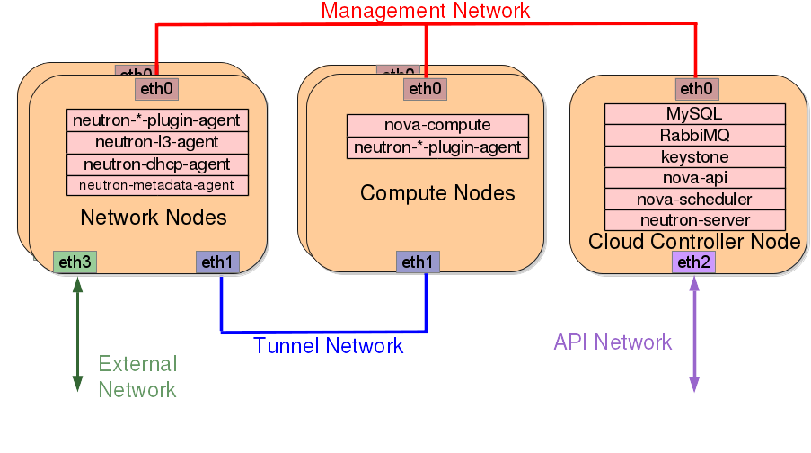

# Scenario: HA routers on Linux Bridge using VXLAN tunnels

This configuration provides full L3 HA while using the simpler Linux Bridge environment. A minimum of two network nodes are required to provide HA fail over in the event that one network node fails.

Note: VXLAN tunnels require L2Population, due to bug -  ???? HA routers and L2Population do not work correctly. This bug is expected to be fixed in the Kilo release.

System environment:



## Configuration:

The configuration files on each node are similar with only the local_ip set to the interface on the data network. The crutial settings are indicated as follows:

1. Configure the base options

   1. Edit the /etc/neutron/neutron.conf file:

    ```
   router_distributed = False
   l3_ha = True
   max_l3_agents_per_router = 3
   min_l3_agents_per_router = 2
   l3_ha_net_cidr = 169.254.192.0/18
    ```

   2. Edit the l3_agent.ini file:
 
    ```
    agent_mode = legacy
    ```

 
1. Configure the ML2 plug-in.

   1. Edit the /etc/neutron/plugins/ml2/ml2_conf.ini file:
 
    ```
    [linuxbridge]

    [l2pop]
    agent_boot_time = 180

    [vxlan]
    enable_vxlan = True
    local_ip = TUNNEL_NETWORK_INTERFACE_IP
    l2_population = True
    ```
 
 
  Note: Replace NOVA_ADMIN_USERNAME, NOVA_ADMIN_TENANT_ID, and
  NOVA_ADMIN_PASSWORD with suitable values for your environment.


1. Start the following services
   1. Controller node:
      * Server
   2. Network node(s):
      * Open vSwitch
      * Open vSwitch agent
      * L3 agent
      * DHCP agent
      * Metadata agent
   3. Computer node(s):
      * Open vSwitch
      * Open vSwitch agent

##Create the routers and gateway:

    ```
    neutron net-create private
    neutron subnet-create --name private-subnet private 10.1.0.0/28
    neutron net-create private1
    neutron subnet-create --name private1-subnet private1 10.2.0.0/28
    neutron net-create --shared public --router:external=True
    neutron net-create --shared public --router:external=True --provider:network_type flat --provider:physical_network phy-br-ex
    neutron subnet-create --name public-subnet public  --allocation-pool start=172.16.0.32,end=172.16.0.64 --gateway=172.16.0.5 --enable_dhcp=False 172.16.0.0/24
    neutron router-create MyRouter --distributed False --ha True
    neutron router-interface-add MyRouter private-subnet
    neutron router-interface-add MyRouter private1-subnet
    neutron router-gateway-set MyRouter public
    ```

##Boot two VMs, one on each network:

    ```
    nova boot --image cirros-qcow --flavor 1 --nic net-id=<UUID of private network> One
    nova boot --image cirros-qcow --flavor 1 --nic net-id=<UUID of private1 network> Two
    ```
    


